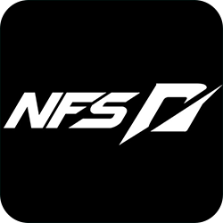
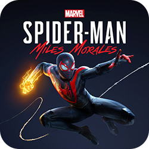
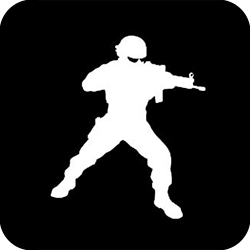

    

    
    
     

  <!--<h3>I'm Ahmad Raza, a final year university student 🏫 majoring in Software Engineering 💻</h3>-->
    <h3>ℑ'𝔪 𝔄𝔥𝔪𝔞𝔡 ℜ𝔞𝔷𝔞, 𝔞 𝔣𝔦𝔫𝔞𝔩 𝔶𝔢𝔞𝔯 𝔲𝔫𝔦𝔳𝔢𝔯𝔰𝔦𝔱𝔶 𝔰𝔱𝔲𝔡𝔢𝔫𝔱 🏫 𝔪𝔞𝔧𝔬𝔯𝔦𝔫𝔤 𝔦𝔫 𝔖𝔬𝔣𝔱𝔴𝔞𝔯𝔢 𝔈𝔫𝔤𝔦𝔫𝔢𝔢𝔯𝔦𝔫𝔤 💻</h3>

<!--

-->

 
  
- 🔭 I’m currently working on a Python Project
- 🌱 I’m currently learning the concept of Deep Learning  
- ⚡ Fun fact: I use tabs over spaces
<!--- 📫 How to reach me **ARRuhomaun@gmail.com**-->
  
 

  <b>❝𝙲𝚘𝚗𝚏𝚞𝚜𝚒𝚘𝚗 𝚒𝚜 𝚙𝚊𝚛𝚝 𝚘𝚏 𝚙𝚛𝚘𝚐𝚛𝚊𝚖𝚖𝚒𝚗𝚐❞ - Felienne Hermans</b>

  
   

## My Tech Stack:

    <h4>Languages                </h4> 

    <h4>Frameworks & Library              </h4> 

    <h4>Tools             </h4> 

    <h4>IDEs          </h4> 

   

## GitHub Stats:

    <!--height="150"--> 
   
<!--  -->
  
  <!---->

 

## Connect with me  

<!--

-->

  

  
  
   

## W-A-S-D 🎮 

  
  &nbsp;
  &nbsp;
  &nbsp;
  &nbsp;
  &nbsp;
  &nbsp;
  &nbsp;
  &nbsp;
  &nbsp;
  &nbsp;
  &nbsp;
  &nbsp;
  

  

    

  

